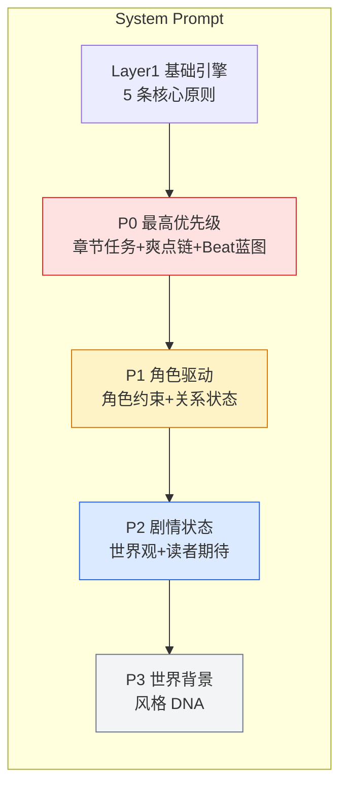
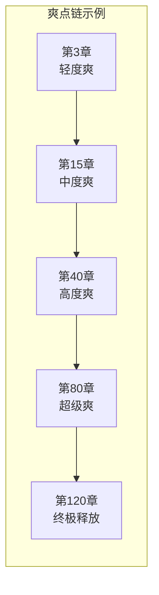
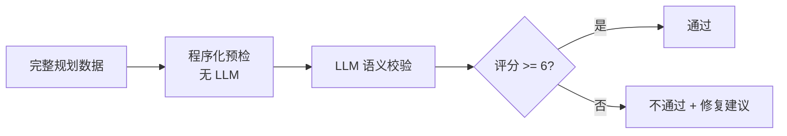
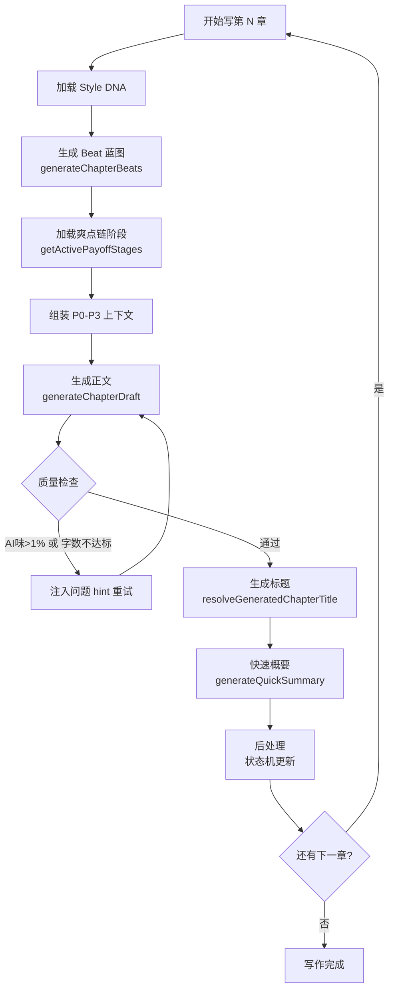
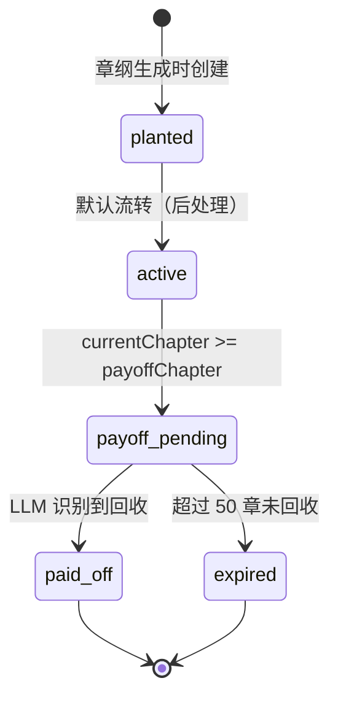

# Dream Writer 创作流水线工作流文档

> 最后更新：2026-06-24
> 版本：v2.5（含 Style DNA / P0-P3 优先级 / Beat 蓝图混合模式 / 爽点链引擎 / ChapterType 系统 / 剧情承接检测）

---

## 一、流水线总览

### 1.1 完整流程图

```mermaid
flowchart TD
    Start([用户输入]) --> InputMode{输入模式?}

    InputMode -->|inspiration| Analyze[Analyze 分析阶段]
    InputMode -->|structured| StructuredLoad[加载 DB 人物卡+世界观]

    Analyze --> AnalyzeInput[素材分析<br/>判断包含哪些内容]
    AnalyzeInput --> Decompose[资产拆解<br/>大纲/人物/世界观/风格/卷]
    Decompose --> GenerateOutline[大纲生成<br/>generateOutline]
    StructuredLoad --> GenerateOutlineFromStructured[结构化大纲生成<br/>generateOutlineFromStructured]

    GenerateOutline --> Assets[Assets 资产生成阶段]
    GenerateOutlineFromStructured --> Assets
    Decompose --> Assets

    Assets --> CheckWorldview{世界观已有?}
    CheckWorldview -->|否| GenWorldview[世界观生成<br/>generateWorldview]
    CheckWorldview -->|是| CheckCharacter
    GenWorldview --> CheckCharacter{人物已有?}

    CheckCharacter -->|否| GenCharacters[人物生成<br/>generateCharacters]
    CheckCharacter -->|是| CheckStyle
    GenCharacters --> CheckStyle{风格已有?}

    CheckStyle -->|否| GenStyle[风格生成<br/>generateStyle<br/>含 styleDna]
    CheckStyle -->|是| StyleAnalysis
    GenStyle --> StyleAnalysis

    StyleAnalysis{有已有章节?<br/>style_analysis} -->|是| AnalyzeStyle[风格分析<br/>styleAnalysisPhase<br/>提取 styleDna]
    StyleAnalysis -->|否| Planning
    AnalyzeStyle --> Planning

    Planning[Planning 规划阶段] --> VolOutline[卷纲生成<br/>generateVolumeOutline]
    VolOutline --> PayoffChain[爽点链生成<br/>payoffChainPhase<br/>generatePayoffChains]
    PayoffChain --> ChapterOutlines[章纲生成<br/>chapterOutlinesPhase<br/>逐卷批次]

    ChapterOutlines --> MainlinesHooks[主线+钩子生成<br/>generateMainlinesAndHooks]
    MainlinesHooks --> StoryArcs[故事弧线生成<br/>generateStoryArcs]

    StoryArcs --> Consistency[Consistency Check<br/>一致性校验]
    Consistency --> ProgPreCheck[程序化预检<br/>无 LLM]
    ProgPreCheck --> LLMSemantic[LLM 语义校验<br/>generateConsistencyCheck]
    LLMSemantic --> ConsistencyPassed{评分 >= 6?}

    ConsistencyPassed -->|否| FixIssues[修复建议<br/>fire-and-forget]
    ConsistencyPassed -->|是| Writing
    FixIssues --> Writing

    Writing[Writing 写作阶段] --> WriteLoop{还有未写章节?}
    WriteLoop -->|是| GenBeats[Beat 蓝图生成<br/>generateChapterBeats]
    GenBeats --> LoadPayoffStages[加载爽点链阶段<br/>getActivePayoffStages]
    LoadPayoffStages --> AssembleContext[上下文组装<br/>P0-P3 优先级]
    AssembleContext --> GenDraft[正文生成<br/>generateChapterDraft]
    GenDraft --> QualityCheck{质量达标?}
    QualityCheck -->|否| RetryHint[注入问题 hint]
    RetryHint --> GenDraft
    QualityCheck -->|是| GenTitle[标题生成<br/>resolveGeneratedChapterTitle]
    GenTitle --> PostProcess[后处理<br/>状态机更新]
    PostProcess --> VolCorrection{每卷结束?}
    VolCorrection -->|是| CorrectOutlines[偏离度检查+章纲修正<br/>correctNextVolumeOutlines]
    VolCorrection -->|否| WriteLoop
    CorrectOutlines --> WriteLoop
    WriteLoop -->|否| Done([完成])

    style Analyze fill:#e0f2fe,stroke:#0284c7
    style Assets fill:#fef3c7,stroke:#d97706
    style Planning fill:#dcfce7,stroke:#16a34a
    style Consistency fill:#fce7f3,stroke:#db2777
    style Writing fill:#ede9fe,stroke:#7c3aed
```



### 1.2 执行顺序

```
outline（大纲）→ assets（资产）→ [style_analysis（风格分析）] → planning（规划）
  └─ volume_outline（卷纲）
  └─ payoff_chains（爽点链）
  └─ chapter_outline_vol_N（章纲，逐卷）
  └─ story_arcs（故事弧线）
→ consistency_check（一致性校验）→ writing（写作）
```

总步骤数公式：`3 (outline) + 3 (assets) + (1 if 结构化输入) + (1 + 1 + volumeCount + 1) (planning) + 1 (consistency) + 1 (writing)`

默认配置（5卷30章/卷）= 3 + 3 + 9 + 1 + 1 = **17 步**

### 1.3 两种输入模式

| 模式 | 触发条件 | 流程差异 |
|------|----------|----------|
| **inspiration**（默认） | 自由文本灵感 | 分析 → 拆解已有资产 → 补充生成缺失资产 |
| **structured** | 结构化人物卡+世界观 | 跳过分析/拆解，直接从 DB 加载 → 生成大纲；已有章节时触发风格分析 |

### 1.4 两种来源类型

| 类型 | 触发条件 | 流程差异 |
|------|----------|----------|
| **idea**（默认） | 全新创作 | 使用 `novel.inspiration` 作为输入 |
| **content** | 续写模式 | 加载最近 10 章内容（最多 8000 字），调用 `generateOutlineFromChapters` |

---

## 二、Prompt 架构：P0-P3 优先级系统

写作阶段采用 P0-P3 四级优先级架构，取代原有 7 层平铺：



### 2.1 P0 — 最高优先级（~600 tokens）

**内容**：上一章结尾 + 章节任务 + 爽点链推进 + Beat 蓝图

```
【★★★ P0 最高优先级 — 本章核心任务 ★★★】

【上一章结尾】
老祖看着工牌上突然出现的神秘文字，心中涌起一股不祥的预感。这行字他从未见过，却隐约觉得与当年的那件事有关……

【本章开头承接要求】
本章前300字必须承接上一章结尾，不得跳过关键事件。这个优先级要高于 Beat 蓝图。

章节目标：老祖在阴间第一次升职
核心冲突：老祖的上司故意刁难
章末钩子：考核通过后，工牌上多了一行字

【爽点链推进】
「老祖打工链」→ 本章推进到：老祖升职
→ 必须包含：老祖从普通鬼差升为小组长的具体场景

【节奏蓝图】
Beat 1 [hook] 300字：老祖被叫到上司办公室，以为要被开除
  必须包含：工牌神秘文字的后续
  必须避免：不要跳过上一章结尾的悬念
Beat 2 [conflict] 600字：上司提出不可能完成的考核任务
  必须包含：考核的具体内容
  必须避免：不要一笔带过考核难度
Beat 3 [dialogue] 400字：老祖和同事讨论对策
  必须包含：同事的具体建议
  必须避免：不要变成独白
Beat 4 [payoff] 500字：老祖用现代方法碾压考核
  必须包含：现代方法的具体应用
  必须避免：不要只用系统提示代替场景
Beat 5 [hook_end] 200字：工牌上出现神秘文字
  必须包含：新悬念的建立
  必须避免：不要仓促结尾
```

### 2.2 P1 — 角色驱动（~300 tokens）

**内容**：本章出场角色约束 + 关系状态

```
【★★ P1 角色驱动 — 人物行为决定剧情 ★★】

本章出场：
- 老祖（林家太爷）：当前情绪=焦虑，目标=通过考核，语言风格=古风口语混搭
- 鬼差张三：性格圆滑，口头禅"得嘞"
- 上司李判官：严厉但公正，说话文绉绉

角色关系：
- 老祖 ↔ 张三：同事+朋友（张三暗中帮老祖）
- 老祖 ↔ 李判官：上下级（李判官在考验老祖）
```

### 2.3 P2 — 剧情状态（~300 tokens）

**内容**：世界观精简摘要 + 读者期待

```
【★ P2 剧情状态 — 保持连续性 ★】

世界观：阴间职场体系，鬼差→组长→判官→阎王
读者期待：每章必须有爽点释放，老祖用现代知识碾压阴间
活跃伏笔：工牌上的神秘文字（第3章埋设，待回收）
```

### 2.4 P3 — 世界背景（~300 tokens）

**内容**：Style DNA 可执行约束 + 本书固定口味 + 章节节奏规则

```
【风格 DNA — 必须严格遵守】
- 节奏控制：每 500 字一个钩子，每 700 字一个笑点，每 1500 字一个爽点
- 语言约束：短句为主，对话占比 40%，叙述占比 60%
- 禁止写法：文青式环境渲染、哲学感悟、大段世界观解释
- 必须写法：每段必须有信息增量，对话必须推进剧情或揭示人物

【本书固定口味 — 长期锁定】
- 读者主要来看：看老祖爆金币、看主角捡好处、看阴间职场
- 喜剧来源：老祖的古风做派 vs 现代职场、阴阳两界的文化冲突
- 核心矛盾/反差：阴间打工阳间享福、八代老祖当代社畜
- 标志性桥段：老祖升职加薪、主角捡漏获得阴间宝物

【章节节奏规则】
- 每 5 章至少出现一次"阴间努力 → 阳间收益"的完整闭环
- 每 3 章至少出现一次喜剧桥段
- 每 10 章至少出现一次主线升级
```

---

## 三、各阶段详解

### 3.1 Analyze Phase（分析阶段）

**文件**: `server/src/services/pipeline/analyzePhase.ts`

**目的**: 分析输入素材，拆解已有资产，生成故事大纲。

**LLM 调用次数**: 最多 7 次
- 1 次分析（判断素材包含哪些内容）
- 最多 5 次拆解（大纲/人物/世界观/风格/卷结构，按需跳过）
- 1 次生成大纲

**数据流**:
```
读取: novel, chapter(续写), character/worldview(结构化), RAG
写入: phaseResult, knowledgeAsset, memory, novel.outline
```

#### 3.1.1 素材分析（analyzeInput）

| 项目 | 内容 |
|------|------|
| **角色** | 资深网文编辑 |
| **温度** | 0.3 |
| **输出** | `{ hasOutline, hasCharacters, hasWorldview, hasStyle, hasVolumes, summary, details }` |

**Prompt 核心**：判断用户素材中已包含哪些内容类型（大纲/人物/世界观/风格/卷结构），以便后续跳过已有内容的生成。

#### 3.1.2 资产拆解（decomposeIntoAssets）

| 资产类型 | 拆解函数 | 存储目标 |
|----------|----------|----------|
| 大纲 | `decomposeOutline` | `novel.outline` |
| 人物 | `decomposeCharacters` | `character` 表 |
| 世界观 | `decomposeWorldview` | `worldview` 表 |
| 风格 | `decomposeStyle` | `styleProfile` 表 |
| 卷结构 | `decomposeVolumes` | `volume` + `chapterOutline` 表 |

**Prompt 共同原则**: "最大程度保留原文内容和表达，只做结构化整理，不改写、不压缩、不丢失任何细节"

#### 3.1.3 大纲生成（generateOutline）

| 项目 | 内容 |
|------|------|
| **角色** | 资深网文策划师 |
| **温度** | 0.7 |
| **maxTokens** | 6000 |
| **核心原则** | 增量补充 — 保留用户原文，只补充缺失部分 |

**Prompt 关键约束**:
- 禁止 AI 味词汇：不禁、不由得、宛如、仿佛、似乎在诉说、一缕、一抹、一丝、缓缓、淡淡地、静静地、默默地、轻轻地、娓娓道来、令人叹为观止
- 禁止空洞修饰语：深刻地、极大地、令人震撼的、无与伦比的
- plotStructure 共 8 个阶段，每阶段至少 3 个具体情节事件（人名+地名+发生了什么）
- 大纲必须能支撑 100 万字以上长篇

**输出结构**:
```json
{
  "title": "作品标题",
  "genre": "类型",
  "theme": "核心主题",
  "hook": "开篇钩子",
  "coreSetting": "核心设定",
  "mainConflict": "主要冲突",
  "protagonist": { "name", "identity", "goal", "growth" },
  "antagonist": { "name", "identity", "motivation" },
  "plotStructure": {
    "setup": "开篇建立（前5%）",
    "rising_action": "上升发展（5%-20%）",
    "first_climax": "第一高潮（20%-35%）",
    "deepening": "深度发展（35%-55%）",
    "major_turning": "重大转折（55%-70%）",
    "escalation": "冲突升级（70%-85%）",
    "final_climax": "最终高潮（85%-95%）",
    "resolution": "收束结局（95%-100%）"
  },
  "highlights": "核心卖点",
  "targetAudience": "目标读者"
}
```

---

### 3.2 Assets Phase（资产生成阶段）

**文件**: `server/src/services/pipeline/assetsPhase.ts`

**目的**: 行动生成世界观、人物、风格（如果分析阶段未拆解到）。

**LLM 调用次数**: 0-3 次（已有则跳过）

#### 3.2.1 世界观生成（generateWorldview）

| 项目 | 内容 |
|------|------|
| **角色** | 资深网文世界观架构师 |
| **温度** | 0.7 |
| **maxTokens** | 3000 |
| **核心原则** | 增量补充 — 大纲中的世界观设定是核心素材 |

**Prompt 关键约束**: 不得引入与已有设定矛盾的新元素，力量体系、规则必须与大纲一致

**输出**: `name / summary / rules / geography / factions / history / powerSystem{ name, levels, rules } / specialElements`

#### 3.2.2 人物生成（generateCharacters）

| 项目 | 内容 |
|------|------|
| **角色** | 资深网文人物设计师 |
| **温度** | 0.7 |
| **maxTokens** | 2000 |

**Prompt 关键约束**: 人物能力必须与世界观力量体系匹配，人物关系必须与大纲一致

**输出**: `characters[{ name, role, identity, motivation, appearance, background, personality, abilities, relationsText }]`

#### 3.2.3 风格生成（generateStyle）

| 项目 | 内容 |
|------|------|
| **角色** | 资深网文风格顾问 |
| **温度** | 0.6 |
| **maxTokens** | 2000 |

**输出结构**（22 个维度 + Style DNA）:
```json
{
  "name": "风格名称",
  "description": "一句话概括",
  "toneAndAtmosphere": "整体基调与氛围",
  "emotionalRhythm": "情绪节奏设计",
  "contrastPatterns": "反差设计",
  "humorStyle": "幽默方式",
  "tensionTechniques": "紧张感制造技巧",
  "suspenseTechniques": "悬念技巧",
  "narrativePov": "叙事视角",
  "tense": "时态",
  "pacing": "整体节奏",
  "sentenceRhythm": "句式节奏",
  "vocabularyLevel": "用词层级",
  "dialogueStyle": "对话风格",
  "chapterOpeningStyle": "开篇方式",
  "chapterEndingStyle": "收尾方式",
  "writingRules": ["写作规则1", "写作规则2"],
  "avoidList": ["避免的写法1", "避免的写法2"],
  "masterWriterStyle": "模仿的作家风格描述",
  "styleDna": {
    "readerEmotion": ["开局就笑", "三章一个反转", "十章一个大高潮"],
    "payoffMechanisms": ["身份反差", "阴间打工", "老祖受苦主角享福"],
    "rhythmRules": {
      "hookEvery": 500,
      "jokeEvery": 700,
      "payoffEvery": 1500
    },
    "languageRules": {
      "sentence": "短句为主",
      "dialogueRatio": 0.4,
      "narrationRatio": 0.6
    },
    "forbiddenPatterns": ["文青描写", "哲学感悟", "大段世界解释"],
    "requiredPatterns": ["每段必须有信息增量", "对话必须推进剧情或揭示人物"],
    // v2.5 新增：本书固定口味
    "fixedTaste": {
      "readerComeFor": ["看老祖爆金币", "看主角捡好处", "看阴间职场"],  // 读者主要来看什么
      "comedySource": ["老祖的古风做派 vs 现代职场", "阴阳两界的文化冲突"],  // 喜剧来源
      "coreContradiction": ["阴间打工阳间享福", "八代老祖当代社畜"],  // 核心矛盾/反差
      "signatureScenes": ["老祖升职加薪", "主角捡漏获得阴间宝物"]  // 标志性桥段
    },
    // v2.5 新增：章节节奏规则
    "chapterRhythm": {
      "payoffEveryN": 5,  // 每 N 章至少出现一次爽点闭环
      "comedyEveryN": 3,  // 每 N 章至少出现一次喜剧桥段
      "upgradeEveryN": 10  // 每 N 章至少出现一次主线升级
    }
  }
}
```

---

### 3.3 Style Analysis Phase（风格分析阶段）

**文件**: `server/src/services/pipeline/styleAnalysisPhase.ts`

**触发条件**: `inputMode === "structured"` 且已有章节存在

| 项目 | 内容 |
|------|------|
| **角色** | 资深文学风格分析师 |
| **温度** | 0.3 |
| **maxTokens** | 4000 |
| **输入** | 最近 5 章约 8000 字 |

**Prompt 8 个分析维度**:
1. 句式特征（长短句比例、从句使用习惯）
2. 词汇水平（用词难度、专业术语频率）
3. 对话模式（对话占比、引号风格、对话标签习惯）
4. 幽默风格（幽默频率、幽默类型）
5. 节奏偏好（段落长度、场景切换频率）
6. 段落结构（段落平均长度、段落间过渡方式）
7. 叙事声音（叙述者距离、介入程度）
8. 具体避免项（基于原文分析的写法）

**关键约束**:
- `exampleParagraphs` 必须从原文直接摘取，不能改写
- `avoidList` 必须基于原文分析，不能列出通用 AI 味词汇
- 每个维度描述必须具体，不能用"适中""一般"等模糊词
- 结果写入 StyleProfile 表的 `customRules` 和 `styleDna` 字段

---

### 3.4 Planning Phase — Volume Outline（卷纲规划阶段）

**文件**: `server/src/services/pipeline/planningPhase.ts`

| 项目 | 内容 |
|------|------|
| **角色** | 资深网文结构师 |
| **温度** | 0.7 |
| **maxTokens** | 16000 |

**Prompt 设计原则**:
- 卷与卷之间要有递进关系：冲突升级、世界观扩展、人物成长
- 每卷要有核心爽点和标志性事件
- 每卷结尾要留钩子
- 每卷必须规划至少 2 个伏笔
- keyEvents 至少 5 个具体事件（涉及谁+发生了什么+导致什么结果）
- endHook 必须是具体的悬念事件

**输出结构**:
```json
{
  "volumes": [{
    "title": "卷标题",
    "goal": "本卷目标（具体可衡量）",
    "conflict": "主要冲突（冲突双方+焦点）",
    "emotion": "情绪基调",
    "newChars": ["新角色"],
    "mapName": "主要场景",
    "endHook": "结尾钩子（具体悬念）",
    "keyEvents": ["事件1", "事件2", "...至少5个"],
    "turningPoint": "转折点",
    "climax": "高潮",
    "foreshadowsPlanned": [
      { "title", "plantChapter", "plannedPayoff", "description" }
    ],
    "characterArcs": [
      { "characterName", "startState", "endState", "keyChange" }
    ],
    "targetWordCount": 本卷建议字数
  }]
}
```

---

### 3.5 Planning Phase — Payoff Chains（爽点链生成阶段）

**文件**: `server/src/services/pipeline/payoffChainPhase.ts`

**执行时机**: 卷纲生成后、章纲生成前

| 项目 | 内容 |
|------|------|
| **角色** | 资深网文爽点设计师 |
| **温度** | 0.7 |
| **maxTokens** | 3000 |
| **核心理念** | 网文读者追的不是剧情，是爽点节奏 |



**Prompt 设计**:
- 每条链 4-6 个阶段：轻度爽 → 中度爽 → 高度爽 → 超级爽 → 终极释放
- 阶段之间必须有因果关系，不能跳跃
- 每个事件必须具体（谁+做了什么+导致什么结果）
- 至少 2-3 条链，覆盖不同类型
- 爽点类型多样：实力展示、身份反差、打脸、逆袭、关系升级、意外收获

**输出结构**:
```json
{
  "payoffChains": [
    {
      "name": "老祖打工链",
      "description": "老祖从阴间底层打工到掌控整个阴间",
      "stages": [
        { "chapter": 3, "event": "老祖第一次送阴德" },
        { "chapter": 15, "event": "老祖开始打工" },
        { "chapter": 40, "event": "老祖升职" },
        { "chapter": 80, "event": "整个阴间给主角打工" }
      ]
    }
  ]
}
```

**写作阶段注入**:
```
【爽点链推进】
本章必须推进「老祖打工链」：老祖升职
→ 正文中必须包含这个爽点的具体释放场景
```

---

### 3.6 Planning Phase — Chapter Outlines（章纲生成阶段）

**文件**: `server/src/services/pipeline/chapterOutlinesPhase.ts`

**LLM 调用次数**: `ceil(chaptersPerVolume / 10)` 次/卷 + 1 次故事弧线。默认配置: 3 * 5 + 1 = **16 次**

**批次策略**: 每 10 章一批生成，避免 token 限制导致质量下降。

#### 3.6.1 主线与钩子生成（generateMainlinesAndHooks）

| 项目 | 内容 |
|------|------|
| **角色** | 资深网文剧情架构师 |
| **温度** | 0.7 |
| **maxTokens** | 2000 |

**Prompt 设计**:
- 主线至少 2-3 条（主线、情感线、成长线等）
- hooks 至少 5-8 个，分布在不同卷和章节
- 钩子类型：suspense / foreshadow / cliffhanger / reversal / power_display
- 钩子强度 1-10 递进

#### 3.6.2 富化章纲生成（generateEnrichedChapterOutlines）

| 项目 | 内容 |
|------|------|
| **角色** | 资深网文章纲设计师 |
| **温度** | 0.7 |
| **maxTokens** | 8000 |

**Prompt 设计原则**:
- 每章必须有明确的目标和冲突
- 章节之间要有节奏变化：紧张→舒缓→紧张
- 每章结尾要有钩子
- 钩子和伏笔必须有明确回收计划
- 爽点分布要有节奏（每 5-8 章至少一个）
- 情绪曲线要有起伏（连续高潮不超 3 章，连续低谷不超 5 章）
- 核心约束: 每章必须独立可执行 — "一个写手即使不看上下文，仅凭单章章纲也能写出完整章节"

**前序卷章摘要的距离压缩策略**:
- 远卷（>1 卷距离）: ~50 tokens 摘要
- 相邻卷: ~150 tokens 摘要
- 当前卷: 完整章纲

**输出结构**（每章，v2.5 新增字段已标注）:
```json
{
  "title": "章节标题",
  "scene": "具体场景/地点",
  "pov": "视角角色名",
  "targetWordCount": 3000,
  "goal": "本章目标",
  "conflict": "核心冲突",
  "emotion": "情绪基调",
  "hook": "章末钩子",
  "mustDo": ["必须完成的事项"],
  "mustNotDo": ["禁止的事项"],
  "characters": [{ "name", "goal", "action" }],
  "hooksPlanted": [{ "title", "description", "type", "intensity", "plannedResolveChapter" }],
  "hooksResolved": [{ "title", "resolvedDescription" }],
  "foreshadowPlanted": [{ "title", "description", "plannedPayoffChapter" }],
  "foreshadowPayoff": [{ "title", "payoffDescription" }],
  "pleasurePoint": {
    "type": "power_up/revenge/shock/romance/resource/status/golden_finger",
    "intensity": 8,
    "description": "爽点描述"
  },
  "emotionData": {
    "emotionType": "tension/release/depression/climax/neutral",
    "intensity": 7,
    "isClimax": false,
    "isTurningPoint": false,
    "isBreathing": false
  },
  // v2.5 新增字段
  "chapterType": "mission",  // 章节类型：task_trigger/mission/payoff/comedy_daily/relationship/danger_escalation/info_reveal/transition
  "readerPromise": "本章让读者看到什么",  // 读者承诺
  "chapterFunction": "兑现什么+开启什么",  // 章节功能
  "requiredReaderEmotion": ["紧张", "期待"],  // 读者应感受到的情绪
  "payoffChainRefs": ["老祖打工链"],  // 关联的爽点链
  "comedyMechanism": "老祖用阳间知识碾压阴间同事",  // 喜剧机制
  "endingQuestion": "工牌上的神秘文字是什么？"  // 章末悬念问题
}
```

#### 3.6.3 故事弧线生成（generateStoryArcs）

| 项目 | 内容 |
|------|------|
| **角色** | 资深网文故事弧线设计师 |
| **温度** | 0.7 |
| **maxTokens** | 5000 |

**输出结构**:
```json
{
  "mainlines": [{
    "title": "主线名称",
    "description": "详细描述",
    "type": "main/sub/emotional/mystery",
    "startChapter": 1,
    "endChapter": 150,
    "milestones": [
      { "chapter", "event", "type", "characters", "causeEffect" }
    ],
    "resolution": "结局方向"
  }],
  "crossVolumeHooks": [{
    "title", "description", "type", "intensity",
    "plantedChapter", "resolvedChapter", "relatedPlantedHook"
  }],
  "emotionCurveSummary": {
    "rhythmPattern": "节奏模式",
    "climaxChapters": [10, 25, 50, ...],
    "breathingChapters": [5, 15, 30, ...],
    "turningPoints": [50, 100]
  }
}
```

---

### 3.7 Consistency Check Phase（一致性校验阶段）

**文件**: `server/src/services/pipeline/consistencyPhase.ts`

**LLM 调用次数**: 1 次校验 + 1 次自动修复建议（fire-and-forget）



#### 第一层: 程序化预检（无 LLM）
- 里程碑-目标映射检查
- 钩子/伏笔范围验证
- 爽点间距检查（最小 3 章间隔）
- 情绪曲线覆盖率
- 角色出场验证

#### 第二层: LLM 语义校验

| 项目 | 内容 |
|------|------|
| **角色** | 资深网文故事编辑 |
| **温度** | 0.3 |
| **maxTokens** | 4000 |

**10 项校验清单**:
1. 钩子一致性：所有钩子是否都有回收章节？
2. 伏笔一致性：埋设/回收配对是否完整？
3. 角色出场逻辑：是否有角色死亡后又出现？
4. 主线覆盖：里程碑事件是否被章节目标覆盖？
5. 情绪节奏：是否有连续 3+ 章高潮或 5+ 章低谷？
6. 爽点分布：间隔是否合理？类型是否多样？
7. 冲突递进：卷间冲突是否有升级？
8. 人物一致性：角色名/能力/性格是否前后一致？
9. 世界观一致性：场景/规则/力量体系是否前后一致？
10. 风格一致性：叙事风格/语调是否统一？

**评分标准**: 1-10 分，>= 6 分通过

**输出结构**:
```json
{
  "overallScore": 8,
  "passed": true,
  "summary": "整体评估",
  "issues": [
    { "type", "severity", "description", "chapters", "suggestion" }
  ],
  "hookStatus": { "total", "resolved", "unresolved" },
  "emotionRhythm": { "climaxDensity", "breathingSpacing", "issues" }
}
```

---

### 3.8 Writing Phase（写作阶段）

**文件**: `server/src/services/pipeline/writingPhase.ts`

**目的**: 逐章生成实际小说内容。

**LLM 调用次数**: 每章 2-4 次
- 1 次标题生成
- 1 次 Beat 蓝图生成
- 1 次章节正文
- 0-2 次质量重试
- 每 10 章: 1 次周期性一致性检查



#### 3.8.1 Beat 蓝图生成（generateChapterBeats）— 混合模式

**v2.5 改进**: Beat 蓝图采用混合模式，普通章节使用程序模板（0 LLM 调用），关键章节使用 LLM 生成。

**ChapterType 系统（8 种章节类型）**:

| chapterType | 说明 | Beat 模板 |
|-------------|------|-----------|
| `task_trigger` | 任务触发章 | hook → reveal → dialogue → conflict → hook_end |
| `mission` | 任务执行章 | hook → conflict → dialogue → twist → payoff → hook_end |
| `payoff` | 爽点释放章 | pressure → reversal → payoff → emotional → hook_end |
| `comedy_daily` | 日常喜剧章 | hook → dialogue → reveal → emotional → hook_end |
| `relationship` | 关系发展章 | hook → dialogue → conflict → emotional → hook_end |
| `danger_escalation` | 危险升级章 | hook → conflict → reveal → dialogue → hook_end |
| `info_reveal` | 信息揭露章 | hook → reveal → dialogue → reveal → hook_end |
| `transition` | 过渡章 | hook → emotional → dialogue → reveal → hook_end |

**混合模式逻辑**:
```typescript
// 普通章节：程序模板生成（0 LLM 调用）
if (!isKeyChapter(outline)) {
  return generateBeatTemplate(chapterType, targetWordCount, outline);
}

// 关键章节：LLM 生成（payoff/danger_escalation/info_reveal + 高潮章/转折章）
return generateChapterBeatsWithLLM(outline, styleDna, ...);
```

**关键章节判定条件**（满足任一即为关键章节）:
- chapterType 为 `payoff` / `danger_escalation` / `info_reveal`
- emotionData.isClimax === true（高潮章）
- emotionData.isTurningPoint === true（转折章）

**9 种 Beat 类型**:

| 类型 | 功能 | 典型字数 |
|------|------|----------|
| `hook` | 开篇钩子，制造好奇 | 200-400 |
| `conflict` | 冲突推进 | 400-800 |
| `dialogue` | 对话场景，揭示人物/推进剧情 | 300-600 |
| `payoff` | 爽点释放 | 300-500 |
| `twist` | 反转 | 200-400 |
| `transition` | 过渡/铺垫 | 200-300 |
| `reveal` | 信息揭露 | 300-500 |
| `emotional` | 情感场景 | 300-500 |
| `hook_end` | 章末钩子 | 200-300 |

**LLM 生成 Prompt 约束**（仅关键章节）:
- 第一个 Beat 必须是 hook，最后一个必须是 hook_end
- 每 2-3 个 Beat 必须有一个高能量类型（payoff/twist/reveal）
- dialogue 不超过总字数 40%，transition 最多 1 个
- 集成 styleDna 的 rhythmRules（hookEvery/jokeEvery/payoffEvery）

**输出结构**:
```json
{
  "beats": [
    {
      "type": "hook",
      "goal": "用XX场景制造好奇",
      "wordTarget": 300,
      "mustInclude": ["具体场景描述"],
      "mustAvoid": ["不要直接说出悬念"]
    },
    {
      "type": "conflict",
      "goal": "XX与XX的正面冲突",
      "wordTarget": 600,
      "mustInclude": ["冲突的具体表现", "角色的反应"],
      "mustAvoid": ["不要跳过冲突"]
    },
    {
      "type": "dialogue",
      "goal": "通过对话揭示XX秘密",
      "wordTarget": 400,
      "mustInclude": ["秘密的具体内容"],
      "mustAvoid": ["不要变成旁白解说"]
    },
    {
      "type": "payoff",
      "goal": "XX能力首次展示，观众震惊",
      "wordTarget": 400,
      "mustInclude": ["能力展示的具体场景", "旁观者的反应"],
      "mustAvoid": ["不要只用系统提示代替场景"]
    },
    {
      "type": "hook_end",
      "goal": "XX突然出现，身份成谜",
      "wordTarget": 250,
      "mustInclude": ["悬念的具体内容"],
      "mustAvoid": ["不要仓促结尾"]
    }
  ]
}
```

**注入写作 prompt 的格式**:
```
【节奏蓝图 — 按以下 Beat 顺序写作】
Beat 1 [hook] 300字：用XX场景制造好奇
  必须包含：具体场景描述
  必须避免：不要直接说出悬念
Beat 2 [conflict] 600字：XX与XX的正面冲突
  必须包含：冲突的具体表现、角色的反应
  必须避免：不要跳过冲突
Beat 3 [dialogue] 400字：通过对话揭示XX秘密
  必须包含：秘密的具体内容
  必须避免：不要变成旁白解说
Beat 4 [payoff] 400字：XX能力首次展示，观众震惊
  必须包含：能力展示的具体场景、旁观者的反应
  必须避免：不要只用系统提示代替场景
Beat 5 [hook_end] 250字：XX突然出现，身份成谜
  必须包含：悬念的具体内容
  必须避免：不要仓促结尾
每个 Beat 之间用空行分隔。每个 Beat 必须有信息增量，禁止水字数。
```

#### 3.8.2 章节正文生成（generateChapterDraft）

| 项目 | 内容 |
|------|------|
| **System** | ContextAssembler 组装的 P0-P3 优先级 prompt |
| **温度** | 0.78 |
| **maxTokens** | max(3000, min(5000, targetWordCount*2)) |

**关键约束**:
- 目标字数范围：targetWordCount 的 80%-120%
- 输出纯正文，不要 Markdown、提纲、解释
- 场景转换用空行分隔
- 对话用引号「」
- 第一章前 300 字内必须建立冲突或悬念
- 每段不超过 4 行
- 必须使用第三人称视角，禁止「我」「我们」
- Beat 蓝图按顺序写作，每个 Beat 之间用空行分隔
- 爽点链推进要求必须在正文中体现

#### 3.8.3 章节标题生成（resolveGeneratedChapterTitle）

| 项目 | 内容 |
|------|------|
| **温度** | 0.72 |
| **maxTokens** | 80 |

**Prompt 约束**: 5-15 个字，不含「第X章」，不使用书名号，避免平淡概括，优先悬念式/冲突式/反转式，不与已有标题重复

#### 3.8.4 质量控制

**质量阈值**:
| 指标 | 阈值 |
|------|------|
| AI 味词汇占比 | <= 1.0% |
| 字数范围 | 目标字数的 80%-150% |
| 风格最低分 | 6/10 |
| 信息密度最低分 | 6/10 |
| 角色一致性最低分 | 6/10 |
| 情绪匹配最低分 | 5/10 |
| 剧情承接评分 | >= 7/10 |
| 最大重试次数 | 2 次 |

**剧情承接检测**（v2.5 新增）:
- 时间跳跃检测：正文中是否出现"几天后"、"一周后"等跳跃词
- 状态突变检测：是否出现过多"突然"、"忽然"、"竟然"等突变词
- 知识跳跃检测：是否出现"原来"、"其实"、"事实上"等知识跳跃词
- 跳章检测：本章开头与上一章结尾的关联度（关键词匹配）
- 评分 < 7 时触发问题报告，< 5 时触发重试

**重试机制**: 首次生成不达标时，将具体问题作为 hint 注入 prompt 重新生成。

#### 3.8.5 偏离度检查与章纲修正

每卷写完后触发：

| 项目 | 内容 |
|------|------|
| **温度** | 检查 0.3 / 修正 0.5 |
| **maxTokens** | 检查 600 / 修正 4000 |

**偏离度评分**（三维度）:
- 情节偏离 (权重 0.5)
- 人设偏离 (权重 0.3)
- 世界观偏离 (权重 0.2)

**触发条件**: 情节偏离 >= 5 或 人设偏离 >= 4 或 世界观偏离 >= 4

---

### 3.9 Post-Processing（后处理阶段）

**文件**: `server/src/services/pipeline/postProcessing.ts`

**LLM 调用次数**: 1 次合并调用（替代原来 5 次独立调用）

**数据流**:
```
写入: storyState, storyStateLog, memory, character(arcSummary/speechStyle/knowledgeScope),
      hook(状态更新), foreshadow(状态更新), chapterSummary
```

**Prompt 设计**:
- 输入: 章节内容（截断 3000 字）+ 出场角色 + 计划回收的钩子/伏笔
- 输出: 一次提取全部后处理数据

**输出结构**:
```json
{
  "storyState": {
    "currentPhase", "protagonistLevel", "protagonistGoal", "protagonistStatus",
    "currentEmotion", "emotionIntensity", "tensionAccumulation",
    "activeForeshadows", "pendingPayoffs",
    "forbiddenActions", "allowedActions",
    "mainConflict", "lastPleasureChapter", "pleasureCooldown"
  },
  "memories": [{ "type", "title", "content", "importance" }],
  "characterUpdates": [{ "name", "arcSummary", "arcDetail", "speechStyle", "knowledge" }],
  "resolvedHooks": ["实际被回收的钩子标题"],
  "paidOffForeshadows": ["实际被回收的伏笔标题"],
  "chapterSummary": { "summary", "keyEvents", "characterChanges", "endingState" }
}
```

---

## 四、上下文组装（ContextAssembler）

**文件**: `server/src/services/pipeline/contextAssembler.ts`

每章写作前，`ContextAssembler` 从 DB 加载以下数据并组装为 ~1,500 tokens 的 system prompt：

| 数据 | 加载逻辑 | Token 预算 | 优先级 |
|------|----------|-----------|--------|
| Layer1 基础引擎 | 固定模板 | ~300 | 基础 |
| 本章任务 + Beat + 爽点链 | ChapterOutline + ChapterBeat + PayoffChain | ~600 | P0 |
| 角色约束 | 本章出场角色精简卡片 + 关系 | ~300 | P1 |
| 世界观 + 读者期待 | worldview 截断 300 字 + novel.readerExpectations | ~300 | P2 |
| 风格 DNA | styleProfile.styleDna（含 fixedTaste/chapterRhythm）或抽象风格 | ~300 | P3 |
| 前文回顾 | 最近 3 章概要 + 每 50 章里程碑摘要 | ~300 | 辅助 |
| RAG 检索 | 与本章相关的历史上下文 | ~200 | 辅助 |
| 关键记忆 | 高重要度记忆（importance >= 6） | ~150 | 辅助 |
| 剧情状态 | storyState（主角处境/目标/禁止-允许列表） | ~200 | 辅助 |
| 活跃钩子 | 未解决的钩子（最多 8 个） | ~100 | 辅助 |
| 已埋伏笔 | 未回收的伏笔（最多 8 个） | ~100 | 辅助 |
| 活跃主线 | 当前章节范围内的主线（最多 5 条） | ~150 | 辅助 |

**总计**: ~1,500 tokens（相比全量 JSON ~15,000 tokens 节省 90%）

---

## 五、伏笔生命周期管理

**文件**: `server/src/services/ForeshadowService.ts`

### 5.1 状态流转



### 5.2 状态触发条件

| 状态转换 | 触发方式 | 时机 |
|----------|----------|------|
| → planted | 章纲生成时创建 | planning 阶段 |
| planted → active | 默认流转 | 后处理阶段 |
| active → payoff_pending | `manageForeshadowLifecycle` | 当 `currentChapter >= payoffChapter` |
| → expired | `manageForeshadowLifecycle` | 超过 50 章未回收 |
| → paid_off | 后处理 LLM 检测 | LLM 在章节内容中识别到伏笔回收 |
| → paid_off | 一致性校验检测 | `detectForeshadowResolutions` 扫描已完成章节 |

### 5.3 伏笔回收的双重机制

1. **LLM 语义判断**（逐章）: 后处理阶段 LLM 分析章节内容，判断哪些伏笔被实际回收
2. **文本匹配降级**（批量）: 一致性校验阶段扫描已完成章节，通过关键词匹配检测回收

---

## 六、关键设计模式

### 6.1 增量补充（Incremental Supplementation）

每个生成器都遵循"增量补充"原则：
- 用户的创意是核心素材，必须最大程度保留原文内容和表达
- 只补充用户未涉及的部分，不改写已有内容
- 如果用户的创意已经非常完整，只需要做结构化整理和少量补充

### 6.2 反 AI 味（Anti-AI-Smell）

- 每个 system prompt 都包含显式的禁用词汇列表
- 写作阶段有 100+ 个 AI 味词汇/短语的检测列表
- 质量阈值: AI 味词汇占比 <= 1%
- 超标时触发重试，将命中词汇作为负面 hint 注入

### 6.3 Style DNA（风格 DNA）

将风格从"抽象描述"转为"可执行约束"：
- `rhythmRules`: hookEvery/jokeEvery/payoffEvery 字数间隔控制
- `languageRules`: 句式/对话占比/叙述占比
- `forbiddenPatterns`: 禁止的写法模式
- `requiredPatterns`: 必须的写法模式
- 写作 prompt 优先使用 Style DNA 的可执行约束，回退到传统抽象风格

### 6.4 距离压缩上下文（Distance-Based Context Compression）

前序卷章摘要随距离递减：
- 当前卷: 完整章纲
- 相邻卷: ~150 tokens 摘要
- 远卷: ~50 tokens 摘要
- 每 50 章: 里程碑摘要

### 6.5 批次生成（Batch Generation）

章纲每 10 章一批生成，避免 token 限制导致质量下降。

### 6.6 合并后处理（Merged Post-Processing）

原来 5 次独立 LLM 调用（storyState/memories/characterStatus/characterKnowledge/hooks+foreshadows）合并为 1 次调用，读同一段内容只需 1 次。

### 6.7 程序化 + LLM 混合校验

一致性校验结合两种方式：
- 程序化预检: 确定性检查（范围、间距、映射），无 LLM 成本
- LLM 语义校验: 逻辑一致性判断，将程序化预检结果作为上下文传入

### 6.8 质量重试循环（Quality Retry Loop）

每章正文生成后进行质量校验，不达标时将具体问题作为 hint 注入 prompt 重新生成，最多重试 2 次。

### 6.9 偏差修正（Deviation Correction）

每卷写完后，系统测量计划-vs-实际偏差（情节/人物/世界观 3 个维度），超过阈值时自动修正下一卷的章纲。

### 6.10 Beat 级写作蓝图（混合模式）

在章纲和正文之间增加 Beat 层，采用混合模式：
- **普通章节**：使用程序模板生成 Beat（0 LLM 调用），8 种 chapterType 对应 8 套模板
- **关键章节**：使用 LLM 生成 Beat（payoff/danger_escalation/info_reveal + 高潮章/转折章）
- 将章纲拆解为 5-8 个节奏单元
- 每个 Beat 有明确的功能和目标字数
- 第一个必须是 hook，最后一个必须是 hook_end
- 每 2-3 个 Beat 必须有一个高能量类型

**ChapterType 模板映射**:
- task_trigger: hook → reveal → dialogue → conflict → hook_end
- mission: hook → conflict → dialogue → twist → payoff → hook_end
- payoff: pressure → reversal → payoff → emotional → hook_end
- comedy_daily: hook → dialogue → reveal → emotional → hook_end
- relationship: hook → dialogue → conflict → emotional → hook_end
- danger_escalation: hook → conflict → reveal → dialogue → hook_end
- info_reveal: hook → reveal → dialogue → reveal → hook_end
- transition: hook → emotional → dialogue → reveal → hook_end

### 6.11 爽点链引擎

跨章节的爽点节奏链规划：
- 2-3 条爽点链覆盖不同类型
- 每条链 4-6 个阶段，递进式情绪释放
- 写作阶段自动加载当前章节应推进的爽点链阶段
- 每章推进一条或多条爽点链（非强制，根据 chapterType 和 payoffChainRefs 决定）

### 6.12 本书固定口味（Fixed Taste）

Style DNA 新增固定口味维度，长期锁定读者期待：
- `readerComeFor`: 读者主要来看什么（核心吸引力）
- `comedySource`: 喜剧来源（幽默机制）
- `coreContradiction`: 核心矛盾/反差（故事张力）
- `signatureScenes`: 标志性桥段（读者期待的场景类型）

### 6.13 章节节奏规则（Chapter Rhythm）

Style DNA 新增章节级节奏控制：
- `payoffEveryN`: 每 N 章至少出现一次爽点闭环
- `comedyEveryN`: 每 N 章至少出现一次喜剧桥段
- `upgradeEveryN`: 每 N 章至少出现一次主线升级

---

## 七、LLM 调用统计

以默认配置（5 卷 30 章/卷 = 150 章）估算：

| 阶段 | 调用次数 | 说明 |
|------|----------|------|
| Analyze | 1-7 | 1 分析 + 最多 5 拆解 + 1 生成 |
| Assets | 0-3 | 按需跳过 |
| Style Analysis | 0-1 | 仅结构化模式 |
| Volume Outline | 1 | |
| Payoff Chains | 1 | 卷纲后、章纲前 |
| Chapter Outlines | 15-16 | 5 卷 * 3 批/卷 + 1 故事弧线 |
| Consistency Check | 1-2 | |
| Writing - Beats | ~30 | v2.5: 仅关键章节使用 LLM（约 20%），普通章节使用模板 |
| Writing - Draft | 150-450 | 每章 1 次 + 0-2 次重试 |
| Writing - Title | 150 | 每章 1 次 |
| Post-Processing | 150 | 每章 1 次合并调用 |
| Periodic Consistency | ~15 | 每 10 章 1 次 |
| **总计** | **~530-850** | v2.5: Beat 混合模式节省约 120 次 LLM 调用 |

---

## 八、温度/Token 速查表

| 阶段 | temperature | maxTokens |
|------|-------------|-----------|
| 素材分析 | 0.3 | — |
| 大纲生成 | 0.7 | 6000 |
| 世界观生成 | 0.7 | 3000 |
| 人物生成 | 0.7 | 2000 |
| 风格生成 | 0.6 | 2000 |
| 风格分析 | 0.3 | 4000 |
| 卷纲生成 | 0.7 | 16000 |
| 爽点链生成 | 0.7 | 3000 |
| 章纲生成（基础） | 0.7 | 3000 |
| 章纲生成（富化） | 0.7 | 8000 |
| 主线+钩子 | 0.7 | 2000 |
| 故事弧线 | 0.7 | 5000 |
| 一致性校验 | 0.3 | 4000 |
| Beat 蓝图 | 0.7 | 2000 |
| 正文写作 | 0.78 | 3000-5000 |
| 章节标题 | 0.72 | 80 |
| 快速概要 | 0.2 | 150 |
| 结构化概要 | 0.2 | 400 |
| 偏离度检查 | 0.3 | 600 |
| 章纲修正 | 0.5 | 4000 |

**温度分布规律**: 创意生成类任务 0.7，风格/一致性/分析类任务 0.3，正文写作最高 0.78，风格生成略低 0.6。

---

## 九、数据存储一览

| 数据类型 | 存储表 | 写入阶段 |
|----------|--------|----------|
| 故事大纲 | `novel.outline` | Analyze |
| 世界观 | `worldview` | Assets / Analyze(decompose) |
| 人物 | `character` | Assets / Analyze(decompose) |
| 风格配置 | `styleProfile` (含 styleDna) | Assets / Style Analysis |
| 卷结构 | `volume` | Planning |
| 爽点链 | `payoffChain` | Payoff Chains |
| 章纲 | `chapterOutline`（含 chapterType/readerPromise 等 7 个新字段） | Chapter Outlines |
| 钩子 | `hook` | Chapter Outlines |
| 伏笔 | `foreshadow` | Chapter Outlines |
| 爽点 | `pleasurePoint` | Chapter Outlines |
| 情绪曲线 | `emotionCurve` | Chapter Outlines |
| 主线 | `mainline` | Story Arcs |
| 一致性问题 | `consistencyIssue` | Consistency Check |
| Beat 蓝图 | `chapterBeat` | Writing |
| 章节内容 | `chapter` | Writing |
| 剧情状态 | `storyState` + `storyStateLog` | Post-Processing |
| 记忆 | `memory` | Post-Processing |
| 章节摘要 | `chapterSummary` | Post-Processing |
| 角色知识范围 | `character.knowledgeScope` | Post-Processing |
| 阶段结果 | `phaseResult` | 各阶段 |
| 知识库 | `knowledgeAsset` | 各阶段 |
